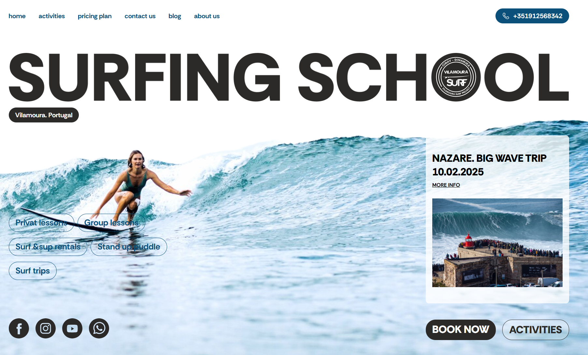

# 🏄‍♂️ Vilamoura Surfing School

A responsive landing page for a surfing school in Portugal.  
Built with **HTML, CSS, and JavaScript** — no frameworks, no Bootstrap.  
Deployed on **Netlify**: [vilamourasurfing.netlify.app](https://vilamourasurfing.netlify.app)

---

## 🌐 Live Demo
🔗 [Click here to view the project](https://vilamourasurfing.netlify.app)

---

## ✨ Features
- Fully responsive design (mobile-first approach)
- Clean UI with simple navigation
- Sections for:
  - Surfing school introduction
  - Courses and services
  - Contact information
- Built without external CSS frameworks (pure CSS + Flexbox/Grid)

---

## 🛠️ Tech Stack
- **HTML5**
- **CSS3** (Flexbox, Grid)
- **JavaScript (ES6+)**
- Deployment: **Netlify**

---

## 📸 Screenshots



---

## 🚀 Getting Started
To run this project locally:

```bash
# Clone the repository
git clone https://github.com/your-username/vilamourasurfing.git

# Open index.html in your browser
